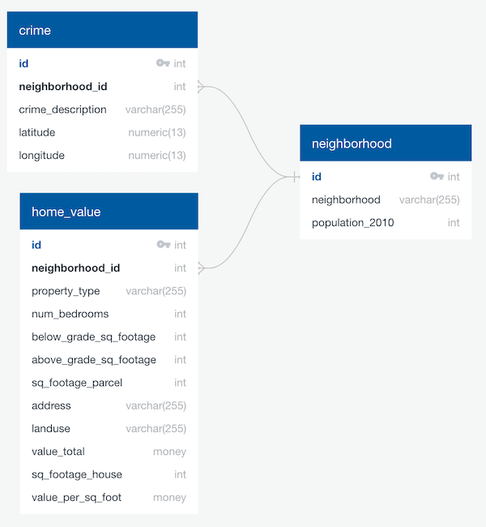

# Minneapolis Home Pricing Forecast - ETL Report

## Project Background
This project was prepared by Katrina Koenders, Stacy Konkiel and Jenna Nytes as part of the University of Minnesota Data Visualization and Analytics Bootcamp. The following project prepares data in response to a hypothetical scenario.

## Summary
This project prepares data for a real estate analysis team, who want to find opportunities for investment. The data will enable them to find trends in housing prices in relation to Minneapolis neighborhoods, recent crime rates, and home characteristics.

An example table that could be eventually generated using this database might be:

```
‘neighborhood_trends’ view
  neighborhood_id = Column(Integer)
  avg_home_price = Column(Integer)
  value_per_sqft = Column(Integer)
  crime_rate = Column(Float)
```

## Data sources
* City of Minneapolis  [Neighborhood](http://opendata.minneapolismn.gov/datasets/minneapolis-neighborhoods)  data - a canonical set of neighborhoods and identifiers

* City of Minneapolis  [Assessor Parcel Data 2019](http://opendata.minneapolismn.gov/datasets/assessors-parcel-data-2019)  - home values and building information

* City of Minneapolis  [Police Incidents Data 2019](http://opendata.minneapolismn.gov/datasets/police-incidents-2019)  - crime types and locations

* City of Minneapolis  [2010 census](http://www.minneapolismn.gov/census/2010/census_2010)  data - neighborhood population data

## Data preparation
1. Retrieve data from City of Minneapolis website and Open Data portal

2. Clean datasets, including replacing missing values in neighborhood dataset

3. Filter assessor dataset to include only residential data

4. Merge datasets

	1. Merge neighborhood and census data

	2. Merge neighborhood and assessor data

	3. Merge neighborhood and police incidents data

5. Load data to PostgreSQL relational database

6. Create table views that aggregate core data as starter for analysts

## Data notes
* Neighborhood data: Source data did not include a codebook that explained column names, so we used ‘FID’ as the primary key based on the fact that it is a unique ID.

* Assessor data: Originally planned to supplement assessor data with Google Geocoding API latitude/longitude data (for eventual mapping), but given the $0 budget for this project, it is cost prohibitive (~130,000 addresses would require a $700 budget). Look into writing these costs into future project budgets.

* Assessor data: This includes a calculated column for price per square foot. This is possible because the database is currently relatively small (< 1 GB). We may want to remove this as the database grows, and provide instructions for retrieving this information using a saved table view instead.

* Assessor data: We converted a lot of null values to “0” for the above and below grade square footage (dealing with properties with no basements and below-ground properties). We also converted nulls to zeroes for number of bedrooms.

* Crimes data: We dropped less than ten records that were recorded crimes without neighborhoods.

* Assessor and police tables both included neighborhood identifiers, but for the sake of standardization and database size, we decided to replace names with neighborhood IDs.

## PostgreSQL database


**neighborhood** 
* id INT PRIMARY KEY
* neighborhood VARCHAR(255)
* population_2010 INT

**crime**
* id INT PRIMARY KEY
* neighborhood_id INT
* crime_description VARCHAR(255)
* latitude NUMERIC(13)
* longitude NUMERIC(13)
* FOREIGN KEY (neighborhood_id) REFERENCES neighborhood (id)

**home_value** 
* id INT PRIMARY KEY
* neighborhood_id INT
* property_type VARCHAR(255)
* num_bedrooms INT
* below_grade_sq_footage INT
* above_grade_sq_footage INT
* sq_footage_parcel INT
* address VARCHAR(255)
* landuse VARCHAR(255)
* value_total MONEY
* sq_footage_house INT
* value_per_sq_foot MONEY
* FOREIGN KEY (neighborhood_id) REFERENCES neighborhood (id)
